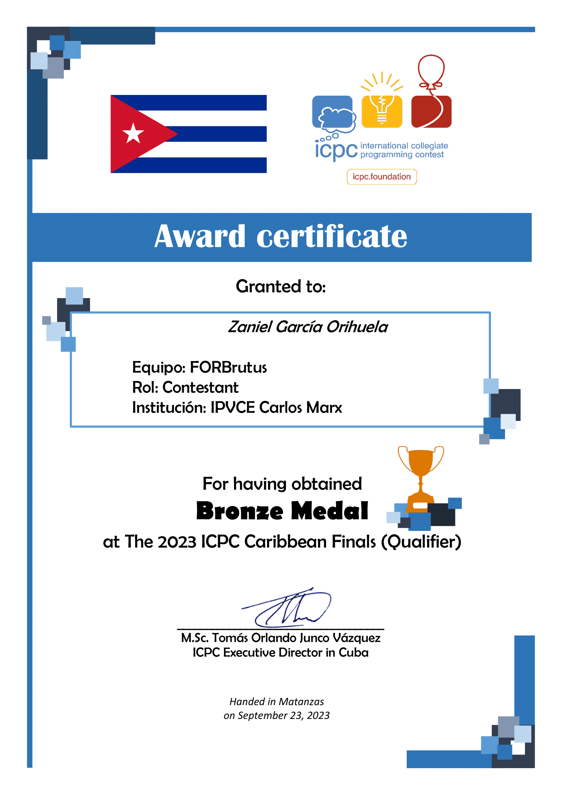
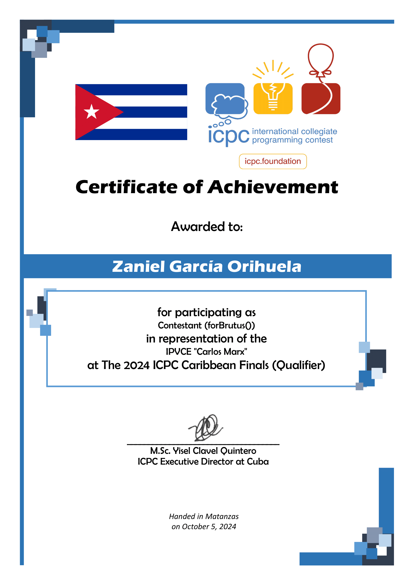
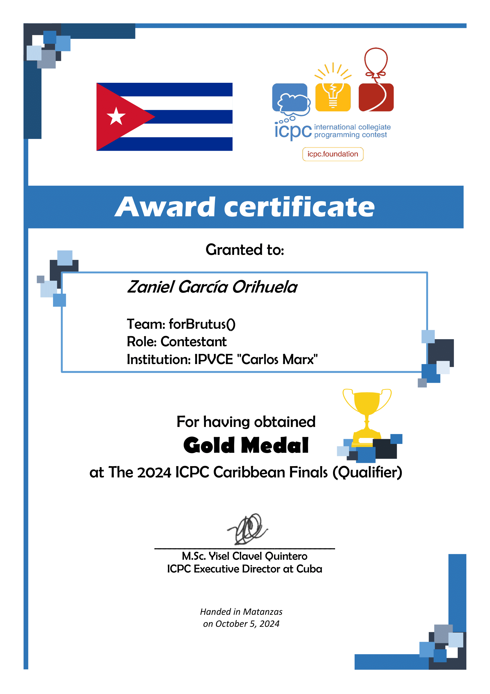
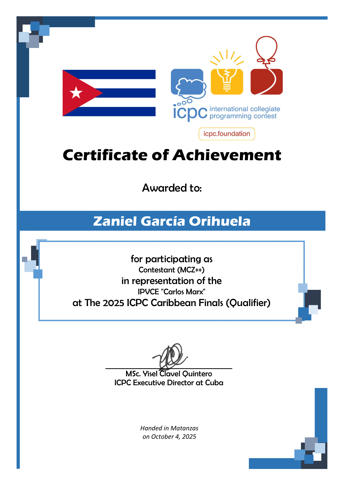
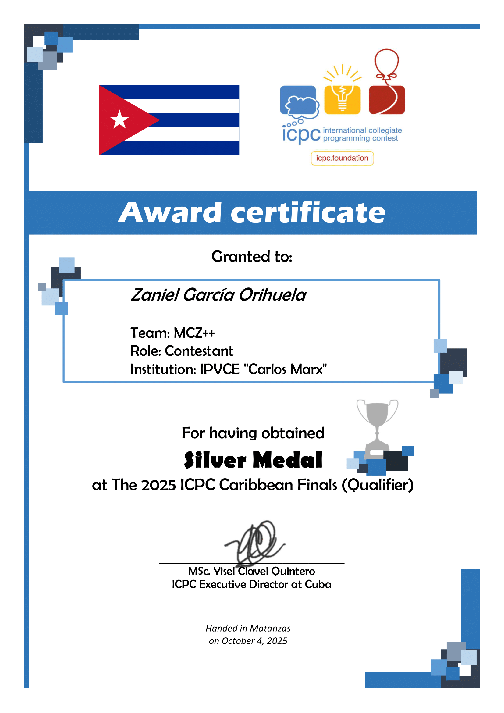
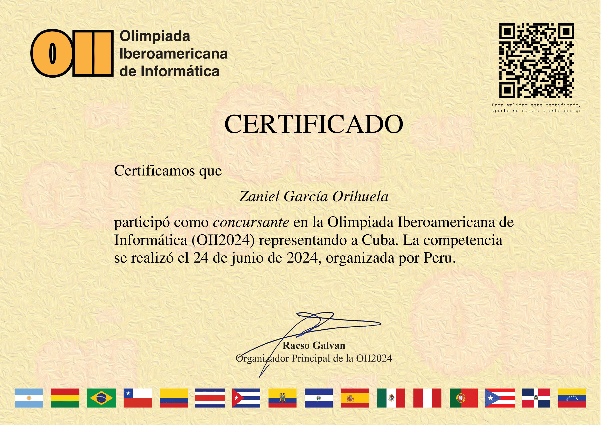
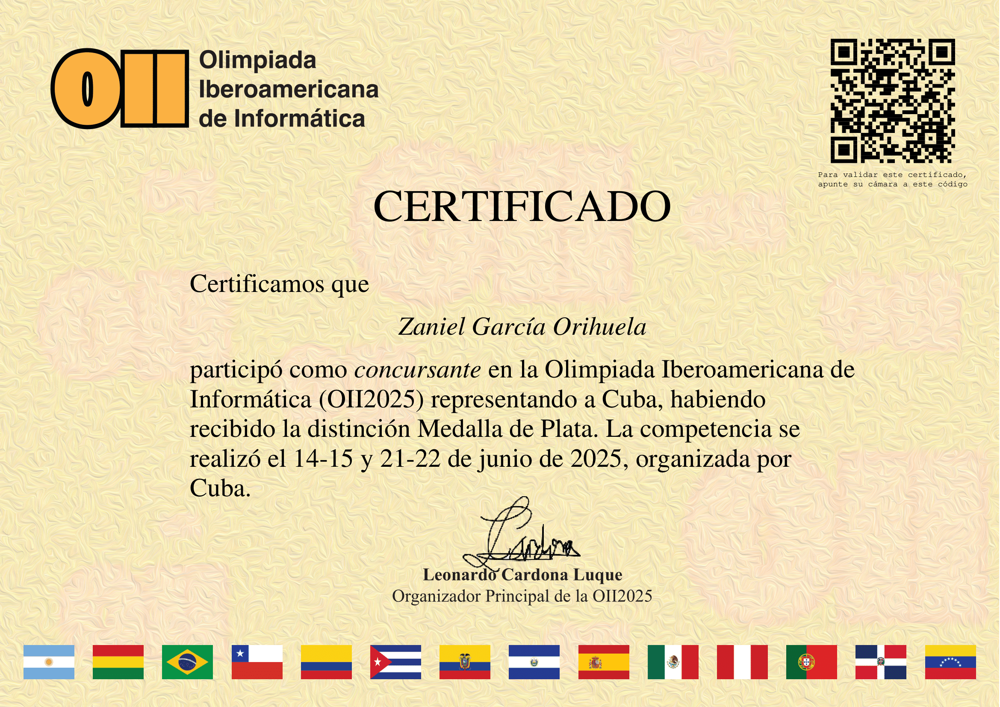

# Zaniel García Orihuela 🇨🇺

## Competitive Programming Contestant History

**2021-2022**

- *ICPC Caribbean Finals (Qualifier)*. Middle school (*ESBU "Fermín Valdés Dominguez"*), Cárdenas, Matanzas.

**2022-2023**

- *ICPC Caribbean Finals (Qualifier)*. High school (*Vocational Preuniversity Institute of Exact Sciences "Carlos Marx" of Matanzas*), Matanzas. ***Bronze medal***.
- Member of *National Pre-Selection*.

**2023-2024**

- *ICPC Caribbean Finals (Qualifier)*. High school (*Vocational Preuniversity Institute of Exact Sciences "Carlos Marx" of Matanzas*), Matanzas. ***Bronze medal***.
- *Cuban Olympiad in Informatics*. ***Gold medal***.
- Member of *National Pre-Selection*.
- *OII (Ibero-American Olympiad in Informatics)*.

**2024-2025**

- *ICPC Caribbean Finals (Qualifier)*. High school (*Vocational Preuniversity Institute of Exact Sciences "Carlos Marx" of Matanzas*), Matanzas. ***Gold medal***.
- Qualified for *ICPC Caribbean Finals*.
- *Cuban Olympiad in Informatics*. ***Gold medal***.
- Member of *National Pre-Selection*.
- *OII (Ibero-American Olympiad in Informatics)*. ***Silver medal***.

**2025-2026**

- *ICPC Caribbean Finals (Qualifier)*. High school (*Vocational Preuniversity Institute of Exact Sciences "Carlos Marx" of Matanzas*), Matanzas. ***Silver medal***.

---

      

 

<!--
**zagaro08/zagaro08** is a ✨ _special_ ✨ repository because its `README.md` (this file) appears on your GitHub profile.

Here are some ideas to get you started:

- 🔭 I’m currently working on ...
- 🌱 I’m currently learning ...
- 👯 I’m looking to collaborate on ...
- 🤔 I’m looking for help with ...
- 💬 Ask me about ...
- 📫 How to reach me: ...
- 😄 Pronouns: ...
- ⚡ Fun fact: ...
-->
